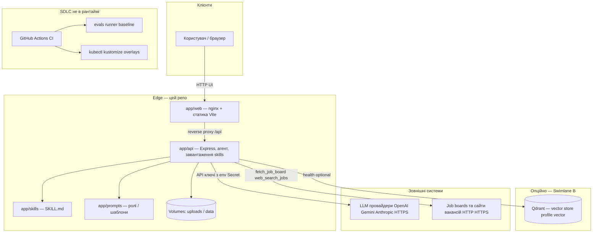
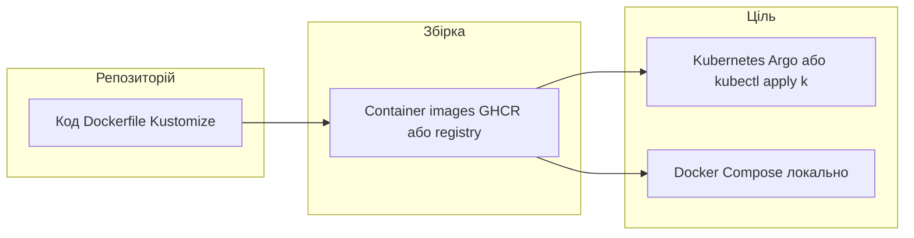

# High-Level Design (HLD) — Scout engineering harness

## Визначення HLD

Файл **HLD (High-Level Solution Design)** — це документ, що пояснює архітектуру, яка буде використана для розробки системи. **Архітектурна діаграма** надає огляд усієї системи, визначаючи основні компоненти, які будуть розроблені для продукту, та їхні інтерфейси.

Нижче в цьому файлі — саме такий огляд для репозиторію Scout (інженерний harness): таблиці компонентів і інтерфейсів, Mermaid-діаграми; деталі платформенного sandbox (abox) — у [`docs/abox-and-scout-topology.md`](abox-and-scout-topology.md).

**Статус:** прийнятий чернетковий HLD для репозиторію `git-push-pray`; при зміні меж системи оновлюйте діаграми й таблицю інтерфейсів у тому ж PR.

## Мета та межі

| Аспект | Опис |
|--------|------|
| **In scope** | Монорепо Scout: UI, API з агентом і tools, версійовані `skills` / `prompts`, Docker/Kubernetes доставка, CI (evals, тести, Kustomize), статичні security gates для skills. |
| **Out of scope (цей репо)** | Повноцінний окремий **worker**-пайплайн (зараз placeholder), production **LLM gateway** (AgentGateway тощо — див. ADR), повний **kagent** як сервіс — рекомендовано **abox**. |

Контекст продукту: **AI job-search assistant**; цей репозиторій — **інженерний harness**: SDLC, деплой, оцінка якості, задел під security/FinOps, а не сам ML-ранжування вакансій.

## Архітектурні принципи

1. **Версійована конфігурація агента** — `app/skills/**/*.md`, `app/prompts/**`; зміни через PR + CI (див. ADR 0004, 0005, 0006).
2. **Спочатку інструменти, потім LLM** — пошук вакансій через HTTP до дошок і provider web search; LLM ранжує лише перевірені URL (див. skills `agent-tools`, `job-search`).
3. **Розділення середовищ** — Kustomize overlays `dev` / `staging` / `prod`; prod — образи по digest.
4. **Безпека на рівні репо** — мінімум секретів у git; статична перевірка skills; PII-aware текст у SKILL (не замінює runtime guardrails).

---

## Діаграма 1 — логічна архітектура рантайму (Docker / Kubernetes)

Показує основні **розроблювані** компоненти продукту та зовнішні залежності.

---

## Діаграма 2 — доставка та кластер (спрощено)

Повна топологія **abox + окремий кластер Scout**: [`docs/abox-and-scout-topology.md`](abox-and-scout-topology.md), ADR [`docs/adr/0003-abox-vs-scout-clusters.md`](adr/0003-abox-vs-scout-clusters.md).

---

## Логічні компоненти (рівень продукту)

| # | Компонент | Призначення |
|---|-------------|---------------|
| 1 | **Clients** | Браузер або інший HTTP-клієнт до `web` (порт за замовчуванням 8080). |
| 2 | **`app/web`** | SPA + nginx; проксує `/api/` на сервіс API. |
| 3 | **`app/api`** | HTTP API, маршрути, агентний потік, завантаження CV, виклик LLM і **in-process tools** (дошки, web search). |
| 4 | **`app/skills` + `app/prompts`** | Версійована поведінка та ролі; монтується в контейнер API (`SKILLS_DIR`). |
| 5 | **`app/worker`** | **Placeholder** у монорепо — черги / фонові джоби не реалізовані; майбутній розрив навантаження з API. |
| 6 | **Qdrant (опційно)** | Профіль `vector` у Compose; health у API — без повного RAG-пайплайну в коді (див. Swimlane B). |
| 7 | **`platform/`** | Kustomize база + overlays; опційно Argo CD (`platform/argocd/`). |
| 8 | **`evals/`** | Детерміновані кейси + runner; gate у CI (Swimlane C). |
| 9 | **LLM / дошки** | Зовнішні провайдери та публічні сайти; ключі лише з env/Secrets. |

---

## Інтерфейси між компонентами

| From | To | Протокол / контракт | Примітки |
|------|-----|---------------------|----------|
| Browser | `web` | HTTP(S) | Статика UI; `/api/*` проксується на API. |
| `web` | `api` | HTTP (upstream у nginx) | `API_UPSTREAM` у Compose. |
| `api` | `skills` / `prompts` | Файлова система (read-only в image) | `SKILLS_DIR`; див. `app/api/ai/skills/loader.ts`. |
| `api` | uploads / data volume | Файлова система | CV та кеш даних; не комітити вміст. |
| `api` | Qdrant | HTTP gRPC клієнт (за наявності `QDRANT_URL`) | Лише health/задел; повна індексація — окрема задача. |
| `api` | LLM providers | HTTPS JSON (SDK провайдера) | Ключі з env; gateway — поза репо (ADR). |
| `api` | Job boards / web | HTTP через tools | `fetch_job_board`, `web_search_jobs`; URL з allow-list у логіці агента. |
| CI | репозиторій | Git checkout | `swimlane-b`, `swimlane-c-evals`, `api`, `web`, `kustomize` jobs. |
| Registry | Kubernetes | OCI pull | `imagePullSecrets` для приватного GHCR; prod — digests. |

---

## Потоки даних (коротко)

1. **Пошук вакансій:** клієнт → API → tools (HTTP до дошок / web search) → структуровані лістинги → LLM для ранжування / пояснень — у відповіді лише URL з перевірених джерел (див. skills).
2. **CV / cover letter:** завантаження → volume → extraction / tailor / draft skills у контексті LLM; **PII** — політики в SKILL та майбутній runtime redaction (Swimlane D).

---

## Нефункціональні вимоги та трасування

| NFR | Де в репо / доках |
|-----|-------------------|
| Якість регресій | `evals/`, ADR 0005, `docs/swimlane-c-evals.md` |
| Статична перевірка skills | `scripts/verify-skills-security.sh`, ADR 0006 |
| Секрети не в git | README Security, `platform/README.md` |
| Деплой | `platform/kustomize`, ADR 0003 |

---

## Пов’язані документи

- [`docs/TASK_BREAKDOWN.md`](TASK_BREAKDOWN.md) — swimlanes і задачі.
- [`docs/swimlane-b-agent-harness.md`](swimlane-b-agent-harness.md), [`docs/swimlane-c-evals.md`](swimlane-c-evals.md).
- [`docs/adr/README.md`](adr/README.md) — індекс ADR.
- Експорт з Excalidraw / draw.io для слайдів можна додати як зображення в `docs/images/` і посиланням сюди — за потреби.
