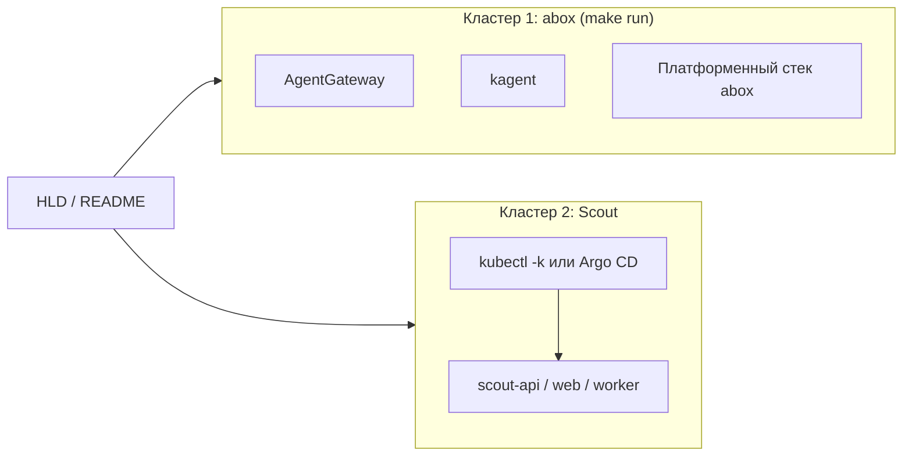

# abox + Scout: как совместить

Задание ссылается на [den-vasyliev/abox](https://github.com/den-vasyliev/abox) — **agentic sandbox** (KinD, AgentGateway, kagent, свой GitOps/OCI и т.д.). В **`git-push-pray`** мы **не** поставляем манифесты Flux: деплой Scout — через **`kubectl apply -k platform/kustomize/overlays/...`** и/или **Argo CD** (`platform/argocd/`).

## Зачем отдельно думать про abox

- **abox** — готовый стек для демо платформы (gateway, агенты, observability по их README).
- **Этот репо** — приложение Scout и **plain Kustomize** (+ опционально Argo).

Конфликт «два Flux в одном `flux-system`» для нас **неактуален**, пока мы сами не ставим второй Flux под Scout. Если позже подключишь Flux — не дублируй полный bootstrap поверх abox без плана.

---

## Схема A (удобно для демо): два кластера / два контекста

**Идея:** abox — **платформенное демо**; Scout — **свой** kind (или другой кластер) с `kubectl`/Argo.

| Кластер | Команда | Для чего |
|---------|---------|----------|
| **abox** | `git clone …/abox && make run` | Пункт задания про sandbox: gateway, kagent, их стек. |
| **Scout** | `kind create cluster` + `kubectl apply -k platform/kustomize/overlays/dev` (или Argo) | Образы Scout, `platform/kustomize`, ваш SDLC. |

**Плюсы:** изоляция, проще объяснить жюри. **Минусы:** два kubeconfig.

---

## Схема B: один кластер

1. Поднял **abox** → в том же кластере Scout: **`kubectl apply -k platform/kustomize/overlays/dev`** (или один `Application` Argo на этот путь). Отдельный Flux из **этого** репозитория не нужен.
2. Или только Scout без abox — обычный kind + Kustomize.

---

## Чеклист демо (схема A)

1. Терминал 1: `abox` → `make run`.
2. Терминал 2: свой kind → `kubectl apply -k platform/kustomize/overlays/dev` (после `kind load`, если без GHCR — см. ниже).
3. В документации: одна фраза — роль abox vs роль `git-push-pray`.

---

## Codespaces

Оба тяжёлых стека в одном тонком окружении могут не влезть по ресурсам: допустимо abox **локально**, Scout **в Codespace** (или наоборот) — опиши в README.

---

## Ссылки

- [abox](https://github.com/den-vasyliev/abox)
- Локальные образы в kind без GHCR: [kind-local-images.md](./kind-local-images.md)
